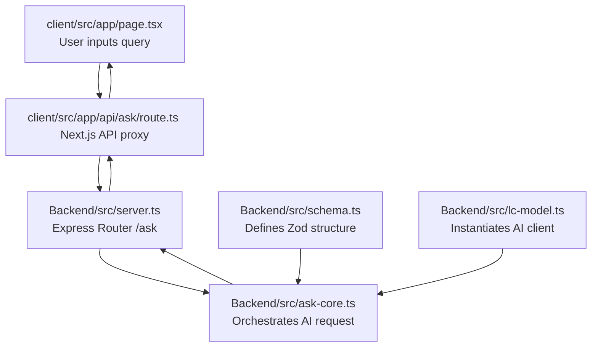

# JSON Format AI Agent Assistant

A modern, full-stack application that queries LLMs (Gemini, OpenAI, or Groq) using LangChain and returns structured, Zod-validated JSON responses (a beginner-friendly summary and a confidence score) to a React/Next.js frontend.

---

## 🔄 Project Architecture & Code Flow

To easily understand how data flows through the application, refer to the diagram and file explanations below:



### 1. Schema Definition (`Backend/src/schema.ts`)
*   Defines the structure of the output we expect using **Zod**.
*   Defines `AskResultSchema` specifying that the model *must* return a `summary` (string) and a `confidence` score (number between 0 and 1).

### 2. Model Client Factory (`Backend/src/lc-model.ts`)
*   Reads backend environmental configurations (`.env`) to identify the active provider (`gemini`, `openai`, or `groq`).
*   Instantiates the corresponding LangChain client (`ChatGoogleGenerativeAI`, `ChatOpenAI`, or `ChatGroq`) with appropriate API keys and base settings.

### 3. Structured Request Handler (`Backend/src/ask-core.ts`)
*   Imports `createChatModel` and `AskResultSchema`.
*   Uses LangChain's `.withStructuredOutput(AskResultSchema)` modifier to bind the Zod schema directly to the model client.
*   Triggers the query with instructions asking the LLM to format its response exactly to the schema.

### 4. Express Server Route (`Backend/src/server.ts`)
*   Exposes the entry POST endpoint `/ask` for the outside world.
*   Calls `askStructure(query)` and handles response delivery, incorporating detailed logging to output issues (e.g. 429 quota limits or rate constraints) directly to the console.

### 5. Frontend UI (`client/src/app/page.tsx`)
*   Captures user inputs, makes fetch requests to Next.js route handlers, prints server logs, manages execution states (loading, success, error flags), and displays answers dynamically.

---

## 🚀 Cloning & Installation Guide

Get this project up and running locally in a few quick steps.

### 1. Clone the Repository
```bash
git clone https://github.com/your-username/json-format.git
cd json-format
```

### 2. Set Up the Backend
1. Navigate into the backend folder:
   ```bash
   cd Backend
   ```
2. Install dependencies:
   ```bash
   npm install
   ```
3. Create a `.env` file in the root of `/Backend`:
   ```env
   PORT=3001
   PROVIDER="gemini" # Options: gemini, openai, groq

   # Set API Key for your provider:
   GEMINI_API_KEY="your-gemini-api-key"
   OPENAI_API_KEY="your-openai-api-key"
   GROQ_API_KEY="your-groq-api-key"
   ```
4. Start the backend developer server:
   ```bash
   npm run dev
   ```
   The backend server runs on [http://localhost:3001](http://localhost:3001).

### 3. Set Up the Frontend (Next.js)
1. In a new terminal window, navigate to `/client`:
   ```bash
   cd ../client
   ```
2. Install dependencies:
   ```bash
   npm install
   ```
3. Create a `.env` file in the root of `/client`:
   ```env
   NEXT_PUBLIC_BACKEND_URL="http://localhost:3001"
   ```
4. Start the frontend developer server:
   ```bash
   npm run dev
   ```
   The user interface is hosted on [http://localhost:3000](http://localhost:3000).

---

## 🛠️ Testing Structured Output
You can test the backend directly using `curl` or any API client:
```bash
curl -X POST -H "Content-Type: application/json" \
     -d '{"query": "Explain quantum computing"}' \
     http://localhost:3001/ask
```
**Expected Response:**
```json
{
  "summary": "Quantum computing is a new type of computer that uses the principles of quantum mechanics...",
  "confidence": 0.95
}
```
